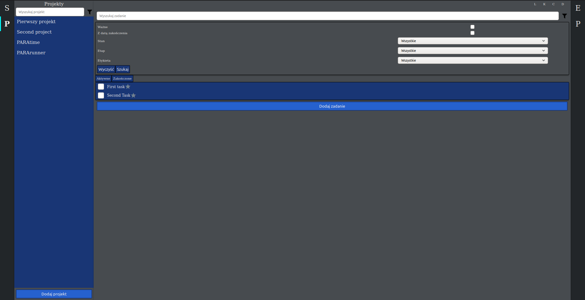
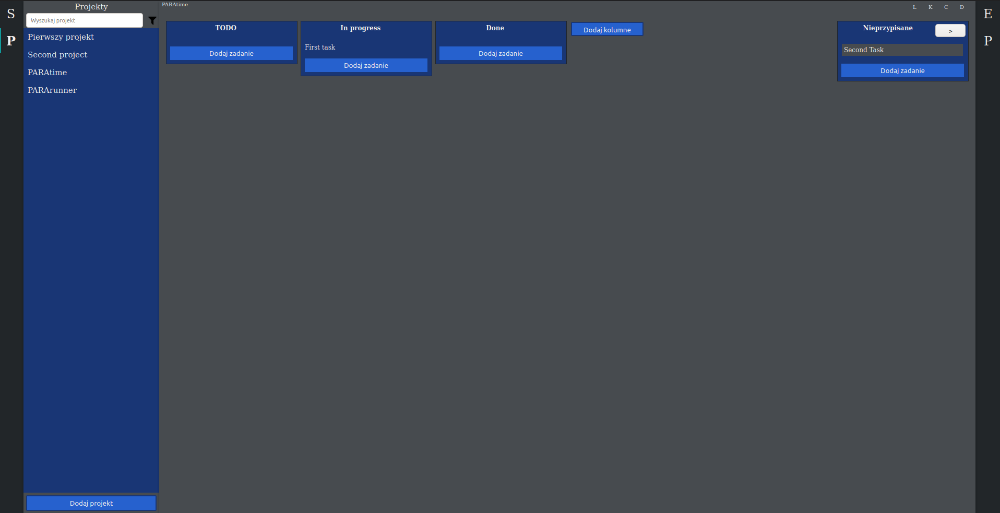
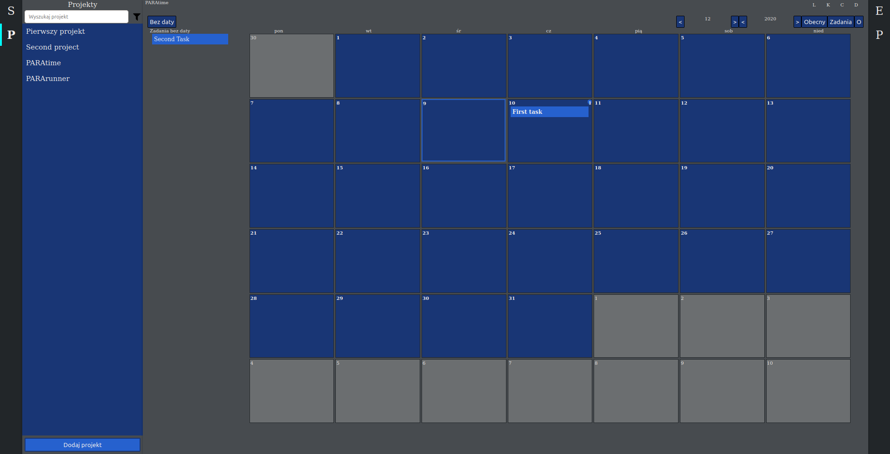
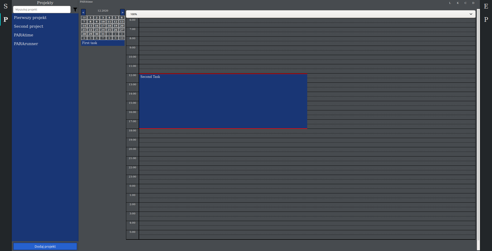
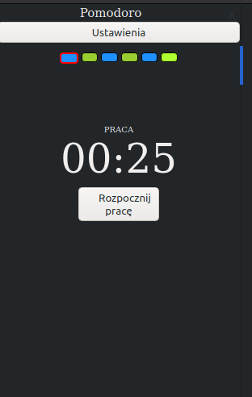

# PARAtime

This repozytory contains a tool that organizes the tasks that user has to do. The application allows you to add and manage tasks and projects. Tasks have information about due date, priotity, subtasks and labels. The application also allows you to organize projects according to the Kanban methodology, thanks to boards. It is also possible manage tasks in the calendar view and the day scheduler view.
The application uses local database.

## Funcionality

### Tasks list


### Kanban board
Boards visually depict work at various stages of a project using cards to represents work items and columns to represent each stage of the project. The application allows you to create any columns.


### Calendar
The calendar view helps you manage the due dates of tasks. Provides a column that displays tasks with no due date. The due date can be set by dragging the task to the field of a specific day.


### Day scheduler
The view allows you to manage tasks for a specific day. It allows you to set the start time of the task and the duration of the task. The column on the left shows the tasks for the day that has no start time assigned.


### Pomodoro
The counter counts the time that the user should spend on work and the time that the user should spend on rest.


## How to use 

nodejs

Installing

```bash
sudo apt install nodejs
```

npm
```bash
sudo apt install npm
```

Initialization of project
```bash
npm init
```

Install electron for project
```bash
npm install –save-dev electron
```

Runing electron application
```bash
npm start
```

Running in browser
```bash
ng serve
```

## TODO
- bugs fix
- appearance
- remote databse
- improvement of the calendar and day scheduler functionality
- task reminder system
- undo/redo
- collaborate on projects
- integration with google calendar
